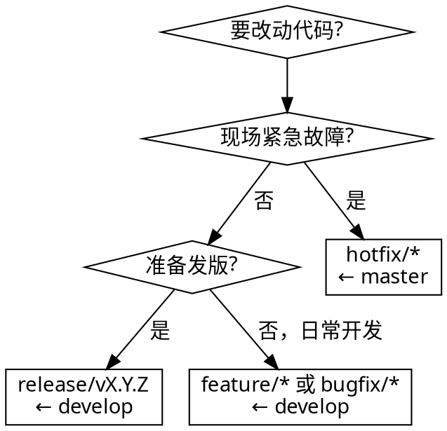

# LMV-2026 Git 分支管理

## 核心原则

**能在 3-5 天内做完合掉的就建分支做；做不完先拆小，而不是让分支变长。功能完成即合、合完即删、master 按版本走。**

病根（团队实测，不是"分支多"而是"分支活太久"）：多个分支领先 master **400+ 提交**，37 个分支堆积——不及时合、合完不删。本 skill 的存在就是为了治这个。

> 规范源头：`docs/Specs/LMV-Git分支管理规范.html`（v1.0，2026-06-13 生效）

## When to Use

本仓库内**任何**涉及 Git 的操作：

- 新建 / 重命名 / 删除分支
- commit、push、提交改动
- 合并到 `develop` / `master`、创建 MR
- 发版打 tag、拉 release / hotfix
- 清理陈旧 / 已合并分支

**铁律：禁止直接向 `develop` / `master` push。** 一切改动走分支 + MR，哪怕只改几行。

## 决策树：建什么分支？



| 改动类型 | 做法 |
|---|---|
| 新功能 / bug 修复 / 重构（哪怕几行） | `feature/*` 或 `bugfix/*` ← develop → MR 合 develop |
| 改文案 / 常量 / 注释等琐碎改动 | 轻量分支，**当天合掉**，可不开 issue |
| 现场紧急故障 | `hotfix/*` ← master → 合 master **+ 回合 develop** |
| 准备发版 | `release/vX.Y.Z` ← develop → master 打 tag → 回合 develop |
| 一次性客户交付 | 做完合回 develop 即删，**不建长期分支** |
| 客户长期定制变体 | `customer/<客户>-*` |
| 想直接改 develop / master | **禁止**，走 MR |

## 分支命名规范

格式：`<类型>/<模块或issue号>-<简短描述>`，**全小写**，词间用连字符 `-`。

```
✅ feature/vcm-junrudder-softlanding
✅ feature/issue-42-pdca-upload
✅ bugfix/issue-108-alarm-state-stuck
✅ hotfix/hive-timezone-offset
✅ release/v3.18.0
✅ customer/byd-mes-adapter

❌ 0604_t              # 纯日期/缩写，无语义
❌ 0508_proj_byd       # 日期前缀
❌ Gly0528-1           # 人名+日期
❌ zhyu                # 个人镜像分支
❌ feature/TEST-2026   # 测试垃圾分支
```

正则（GitLab Push rules 可强制）：`^(master|develop|(feature|bugfix|hotfix|release|customer)/.+)$`

规则：

- 能关联 issue 的，分支名带 issue 号
- 客户定制加客户前缀：`feature/byd-*`、`customer/goer-*`
- **禁止个人镜像分支**（如 `zhyu` ≈ develop）——用本地分支，不要推远程

## 合并方向速查

```
feature / bugfix  ──►  develop
develop  ──►  release/*  ──►  master  ──►  tag
hotfix  ──►  master  (+ 回合 develop)
```

时机纪律：

- **功能做完 + 自测 + 评审通过 → 立刻合，不要攒**
- 大功能**拆成可独立合并的小步**（例：音圈电机 → 先合"基础框架"，再合"DH 协议"，再合"钧舵协议"，每步几天内合掉）
- **feature 分支每周至少同步一次 develop**（rebase 或 merge），把冲突消化在平时
- hotfix 必须同时回合 develop，避免下次发版把同一 bug 带回来

## MR 前置检查清单

向 `develop` / `master` 合并前，逐项确认：

- [ ] 已 merge/rebase 最新目标分支，冲突已解决
- [ ] 本地 `dotnet build LMV-2026.sln` 通过
- [ ] 功能自测通过
- [ ] 至少 1 人 Code Review 通过
- [ ] GitLab CI 流水线绿
- [ ] 已关联对应 issue
- [ ] 合并后**勾选"删除源分支"**

合并方式：`feature/bugfix → develop` 用普通 merge（保留历史），历史过碎用 squash；`release/hotfix → master` 用 merge + 打 tag。

## 发版流程（develop → master）

当前仓库**完全缺失**这个环节，必须补上：

1. 冻结 develop，确认目标范围已全部合入
2. 从 develop 拉 `release/vX.Y.Z`，做最后回归、修订版本号 / 变更记录（**只允许 bug 修复，不加新功能**）
3. `release/*` 合入 master
4. 在 master 打产品级 Tag
5. `release/*` 回合 develop，随后删除 release 分支

> ⚠️ Tag 前缀：仓库用 MinVer + 每项目包级 Tag（`{ProjectName}-v{version}`，如 `Luster.Prism-v1.2.3`）。**产品整体发版用独立前缀**（如 `app-v3.18.0`），避免与 MinVer 包级 Tag 混淆。

## 操作命令模板

### 建分支（从 develop）

```bash
git checkout develop && git pull
git checkout -b feature/<模块>-<描述>
git push -u origin feature/<模块>-<描述>
```

### 每周同步 develop（消化冲突）

```bash
git checkout feature/<分支>
git fetch origin
git rebase origin/develop        # 或 git merge origin/develop
# 解决冲突后：git rebase --continue && git push --force-with-lease
```

### 创建 MR / 评论 → 用 gitlab-manager

**REQUIRED SUB-SKILL:** 创建 MR、查看 MR、添加评论等走 `gitlab-manager` skill（GitLab REST API v4，项目 ID 33）。MR 创建时务必设 `remove_source_branch: true`（合完即删）。

### 月度巡检（清理陈旧分支）

```bash
# 已并入 develop、可删除的分支
git branch -r --merged origin/develop | grep -v -E 'HEAD|master|develop'
# 按最后提交时间列出全部分支（找陈旧分支）
git for-each-ref --sort=committerdate refs/remotes/origin \
  --format='%(committerdate:short) %(authorname) %(refname:short)'
```

清理范围：①已合并分支 ②>30 天无活动分支 ③测试 / 演示垃圾分支。删除远程分支：`git push origin --delete <分支>`。

### 统一 Git 署名

同一人勿用多标识（JZ/jiezhu、gx1555/郭旭、zhangyu/zhyu），统一 `user.name` / `user.email`，便于贡献统计与责任追溯。

## 常见错误（理性化表）

| 想法 / 借口 | 现实 |
|---|---|
| "就改几行，直接 push develop 吧" | 禁止。develop/master 受保护，必须走分支 + MR。轻量分支当天合掉即可。 |
| "分支名用日期 / 我的名字好记" | 禁止。必须 `<类型>/<模块或issue>-<描述>` 语义化。`0604_t`/`zhyu` 是真实反例。 |
| "功能还没完全做完，先不合" | 拆小步，每步独立合。憋 +300 提交的巨型分支就是病根。 |
| "合并完分支留着备查" | 合完即删，MR 里勾选删除源分支。需要时从 MR 找回。 |
| "我的个人分支推远程方便多机" | 用本地分支。禁止推个人镜像分支（`zhyu` ≈ develop）。 |
| "feature 开一周了，等做完再同步" | 现在就同步 develop，否则冲突爆炸。每周至少一次。 |
| "develop 发版直接合 master" | 必须走 release/* 定版回归 + 打 tag + 回合 develop。 |
| "hotfix 合完 master 就行" | 必须同时回合 develop，否则下次发版带回同一 bug。 |
| "分支已经几百个提交了，怎么办" | 本次用 squash 合并到 develop；根因是没拆小。下次建分支起就拆成可独立合并的小步，别再憋巨型分支。 |

## 红旗清单 — 看到就停

- 即将 `git push` 到 `develop` 或 `master`
- 分支名含纯日期、人名、拼音缩写、`TEST`
- feature / bugfix 分支已开 >1 周未合并
- 合并 MR 时未勾选"删除源分支"
- 即将推送个人镜像分支到远程
- 即将合并未通过 `dotnet build` 的分支
- 用 `app-v` 之外的 Tag 前缀标记产品整体发版

**以上任一出现：停下，按本规范纠正后再继续。**
