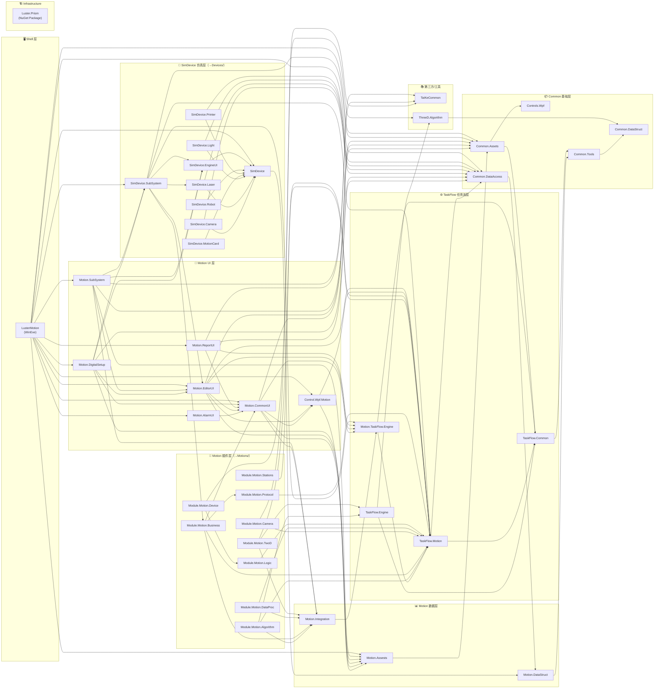

# LM2026 解决方案 - 项目依赖总览

> 文档生成时间：2026-02-10  
> 目标框架：.NET Framework 4.7.2 (`net472`)  
> 解决方案文件：`LM2026.slnx`

## 1. 解决方案概述

LM2026 是 **Luster Motion** 工业运动控制系统的第三代重构版本，采用 **Prism + DryIoc** 模块化架构，基于 WPF 构建。解决方案包含 **41 个项目**，按职责划分为以下层次：

| 层次 | 项目数量 | 说明 |
|------|---------|------|
| **Shell** | 1 | 主程序入口（WinExe） |
| **Infrastructure** | 1 | 基础框架（Prism 封装、日志、配置） |
| **Modules** | 39 | 业务模块（通用、运动、仿真设备、UI 等） |

### 项目分组

| 分组 | 包含项目 |
|------|---------|
| **Common 基础** | `Luster.Common.DataStruct`, `Luster.Common.Tools`, `Luster.Common.DataAccess`, `Luster.Common.Assets`, `Luster.Controls.Wpf` |
| **Motion 数据** | `Luster.Motion.DataStruct`, `Luster.Motion.Assests`, `Luster.Motion.Integration` |
| **TaskFlow 任务流** | `Luster.TaskFlow.Common`, `Luster.TaskFlow.Engine`, `Luster.TaskFlow.Motion`, `Luster.Motion.TaskFlow.Engine` |
| **Module.Motion 运动插件** | `Luster.Module.Motion.Algorithm`, `.Business`, `.Camera`, `.DataProc`, `.Device`, `.Logic`, `.Protocol`, `.Stations`, `.TwoD` |
| **Motion UI** | `Luster.Motion.CommonUI`, `.AlarmUI`, `.EditorUI`, `.ReportUI`, `.DigitalSetup`, `.SubSystem` |
| **SimDevice 仿真设备** | `Luster.SimDevice`, `.Camera`, `.Laser`, `.Light`, `.MotionCard`, `.Printer`, `.Robot`, `.EngineUI`, `.SubSystem` |
| **三方/工具** | `TaiKeCommon`, `Luster.ThreeD.Algorithm`, `Luster.Control.Wpf.Motion` |

## 2. 项目依赖关系图（Mermaid）

> 箭头方向为 **依赖方 → 被依赖方**。仅展示 **ProjectReference** 级别的直接依赖。



## 3. 构建系统与输出结构

### 3.1 统一构建配置

解决方案使用以下文件进行集中管理：

| 文件 | 作用 |
|------|------|
| `Directory.Build.props` | 统一目标框架、输出路径、嵌入式 PDB、版本策略 |
| `Directory.Build.targets` | 模块 DLL 拷贝到 `Devices/`、`Motions/`、`CardErrorCode/` |
| `Directory.Packages.props` | 中央包版本管理（CPM） |

### 3.2 输出目录结构

构建产物统一输出到 `artifacts/bin/{ProjectName}/Debug/net472/`。Shell 项目（`LusterMotion`）构建后会将所有依赖收集为如下扁平结构：

```
artifacts/bin/LusterMotion/Debug/net472/
├── LusterMotion.exe              ← 主程序
├── *.dll                         ← 所有模块 DLL（扁平放置）
├── Config/                       ← 配置文件
│   ├── Error.json
│   ├── Version.json
│   └── Version.xml
├── Devices/                      ← 设备驱动 DLL（CopyToDevicesFolder=true 的项目）
│   ├── Luster.SimDevice.Camera.dll
│   ├── Luster.SimDevice.EngineUI.dll
│   ├── Luster.SimDevice.Laser.dll
│   ├── Luster.SimDevice.Light.dll
│   ├── Luster.SimDevice.MotionCard.dll
│   ├── Luster.SimDevice.Printer.dll
│   └── Luster.SimDevice.Robot.dll
├── Motions/                      ← 运动插件 DLL（CopyToMotionsFolder=true 的项目）
│   ├── Luster.Module.Motion.Algorithm.dll
│   ├── Luster.Module.Motion.Business.dll
│   ├── Luster.Module.Motion.Camera.dll
│   ├── Luster.Module.Motion.DataProc.dll
│   ├── Luster.Module.Motion.Device.dll
│   ├── Luster.Module.Motion.Logic.dll
│   ├── Luster.Module.Motion.Protocol.dll
│   ├── Luster.Module.Motion.Stations.dll
│   └── Luster.Module.Motion.TwoD.dll
├── CardErrorCode/                ← 运动卡错误码配置
├── Langs/                        ← 多语言资源
│   ├── zh-Hans/
│   └── ...
└── LOGO.ico
```

### 3.3 特殊构建属性

| 属性 | 设置项目 | 作用 |
|------|---------|------|
| `CopyToDevicesFolder=true` | SimDevice.Camera/Laser/Light/MotionCard/Printer/Robot/EngineUI | DLL 拷贝到 `Devices/` 子目录 |
| `CopyToMotionsFolder=true` | Module.Motion.* 系列 (9 个) | DLL 拷贝到 `Motions/` 子目录 |
| `CopyErrorCodeFolder=true` | SimDevice.MotionCard | 拷贝 `CardErrorCode/` 目录 |
| `IsShellProject=true` | LusterMotion | 标记为 Shell 项目，触发模块收集 |
| `Costura.Fody` | Tools/Assets/SimDevice.Camera/Laser/Light/MotionCard/Printer/Robot | 将 native DLL 嵌入程序集 |

