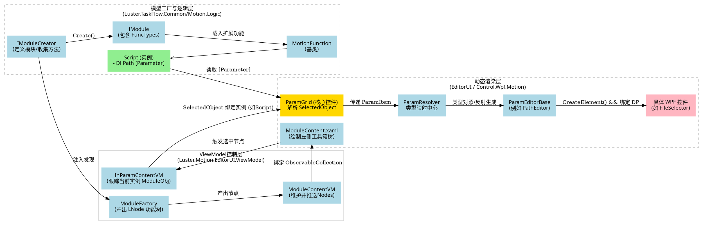

# 运控软件 MotionFunction 架构设计与扩展方案报告

本报告全方位剖析当前解决方案中 `ModuleContent`（工具箱模块列表）与 `InParamContent`（模块参数面板）的核心渲染流转机制，并基于源码层面描绘架构设计图。最后附加完整的二开扩展（添加 Function、Module 及自定义参数渲染类型）详尽教程。

## 一、 核心架构设计与流程分析

### 1. 核心层与组件定位
系统整体架构采用 **Prism (MVVM) + 反射动态生成** 的策略。涉及的核心组件包含三个流转阶段：
- **模型加载层 (逻辑引擎)**:
  - `IModuleFactory`（通常为 `ModuleFactory`）: 负责根据系统配置（如 `AppConfig.System`）遍历 `IModuleCreator` 集合。
  - 每个 `Creator` 生成一个 `IModule`，内含功能字典（`FuncTypes`），指向具体的 `IFunction` (如 `MotionFunction` 的派生类：`Script`, `Trigger` 等)。
  - `ModuleFactory` 将扫出的类型封装成 `LNode` 结构树缓存起来，供 UI 绑定。
- **试图模型层 (ViewModel)**:
  - `ModuleContentVM`: 从 `IModuleFactory` 提取构建好的功能节点树（`ObservableCollection<ModuleNode> Modules`），监听引擎启停事件以动态控制工具箱的可用状态。
  - `InParamContentVM`: 监听工作流内节点（函数实例）的选中变化。将当前被选中的实例赋值给内部的 `ModuleObj` 属性（也是 `ParamGrid.SelectedObject`）。
- **动态试图层 (UI 渲染)**:
  - `ModuleContent.xaml`: 直接使用 `ItemsControl` 绑定 `Modules`，利用预置的主数据模板展示功能分组与叶子节点的 图标（Icon）、提示（Tips）。
  - `InParamContent.xaml` & `ParamGrid`: `ParamGrid` 是一种类似于 PropertyGrid 的反射属性表格。当 `SelectedObject` 被赋值后：
    1. 内部扫面其所有带 `[Parameter]` 特性标记的公共属性，抽象为 `ParamItem` 集合。
    2. 将其交给 `ParamResolver.cs`（解析中心）。
    3. `ParamResolver` 通过字典及类型匹配（Type 对应 `UIEditorType`），派发对应的 `ParamEditorBase` 派生类。
    4. 每个具体的 `ParamEditorBase`（例如 `PathEditor`, `NumberEditor`）调用其自身的 `CreateElement` 方法动态实例化 WPF 控件（例如 `FileSelector`、`NumericUpDown` 等），并通过配置相应的 `DependencyProperty` 建立双向数据绑定。
  
### 2. 架构链路流向图 (DOT)



---

## 二、 二次开发详细操作指南

基于上面的解析流向，添加不同层级特性的做法如下：

### 1. 如何新增一个 Function (最小功能节点)

假如需要开发一个名为 “控制气缸” 的新功能节点，仅需完成如下实体类编写：

```csharp
using Luster.TaskFlow.Common.Attributes;
using Luster.TaskFlow.Common.Models;
using Luster.Module.Motion.Logic.Functions; // 或其他业务组路径
using System;

namespace Luster.Module.Motion.Logic.Functions
{
    public class CylinderFunction : MotionFunction
    {
        public CylinderFunction()
        {
            this.Tips = "气缸控制"; // 在工具箱中显示的名称
            this.Icon = "\xe614";     // 工具箱功能区展示的字体图标 
            this.Group = "气缸";      // 存在分组会折叠进指定的组内
        }

        // 定义属性并利用 [Parameter] 打标签，提供给 ParamGrid 渲染
        [Parameter("Timeout", 1, CN = "超时时间(ms)", CanRef = ParamRef.NoRef)]
        public int Timeout { get; set; } = 5000;

        [Parameter("CylinderIndex", 2, CN = "气缸索引(1~20)", CanRef = ParamRef.NoRef)]
        public int CylinderIndex { get; set; } = 1;

        public override bool DoExcute(out string errMsg)
        {
            errMsg = string.Empty;
            try
            {
                // TODO: 下发气缸驱动指令...
                return true; 
            }
            catch (Exception ex)
            {
                errMsg = ex.Message;
                return false;
            }
        }
    }
}
```
*备注：只要将其附着到某个已注册的 Module 之内（或其原本存放 Functions 的程序集已纳入扫描），下次启动软件系统即会通过 `ModuleFactory` 收集该功能树。*

<br/>

### 2. 如何增加一个新的 Module (主功能集合模块)

如果在新增庞大业务模块，希望在左侧单独辟出独立的 Module 来承载自己的 Functions：

**步骤**:
1. 创建业务 Module 类，继承 `IModule`（用来持有一组 `IFunction`）。
2. 创建该 Module 的生成器类，继承 `IModuleCreator`，设置该 Module 的名称与隶属关系。
3. 确保这个 Creator 被主程序加载（Prism 服务注册或框架内置自动扫描注册）。

```csharp
// ---- 第一步：定义功能集合 ----
public class CustomMotionModule : IModule
{
    public Dictionary<string, Type> FuncTypes { get; set; } = new Dictionary<string, Type>();

    public CustomMotionModule()
    {
        // 注册归属于此模块的函数类
        FuncTypes.Add("CylinderControl", typeof(CylinderFunction));
        FuncTypes.Add("MotorControl", typeof(MotorFunction));
    }
}

// ---- 第二步：定义对应的 Creator ----
public class CustomModuleCreator : IModuleCreator
{
    public string Name => "CustomHardware";
    public string Alias => "专属硬件库";
    public string Tips => "适用于某种定制化硬件的模块";
    public string Icon => "\xe62e"; // 模块顶级图标
    public int Sort => 10;
    
    // 如果系统支持按名称配置分离加载，可在此定义绑定标识 
    public string System => "SystemDefault"; 

    public IModule Create()
    {
        return new CustomMotionModule();
    }
}
```

<br/>

### 3. 如何新增 InParam 自定义类型（参数解析与渲染）

如果要在 Function 里写复杂的参数类型（例如定制弹窗选择、复杂结构体），需要做两部分适配：

**步骤一：定义您的实体模型**
```csharp
// 数据结构定义
public class PointOffsetModel
{
    public double OffsetX { get; set; }
    public double OffsetY { get; set; }
}
```

**步骤二：实现相匹配的编辑器 (`ParamEditorBase`)**
需要定义如何通过该编辑器产出一个 WPF 控件并关联数据：

```csharp
using Luster.Control.Wpf.Motion.Editors; // ParamEditorBase 所在命名空间
using System.Windows;
using HandyControl.Controls; 

public class PointOffsetEditor : ParamEditorBase
{
    // [1] 创建您要呈现给客户的 WPF UI 控件组件
    public override FrameworkElement CreateElement(ParamItem propertyItem)
    {
        var panel = new StackPanel { Orientation = Orientation.Horizontal };
        var txtX = new NumericUpDown { Width = 80, Margin = new Thickness(5,0,0,0) };
        var txtY = new NumericUpDown { Width = 80, Margin = new Thickness(5,0,0,0) };
        
        // （建议开发单独的合成 UserControl，这里为简化说明）
        var customSelector = new MyPointWpfControl();
        return customSelector;
    }

    // [2] 告诉框架，哪个依赖属性跟您的参数值绑定
    public override DependencyProperty GetDependencyProperty()
    {
        return MyPointWpfControl.SelectedPointProperty; // 绑定基类的依赖属性
    }
}
```

**步骤三：将这个体系挂载入当前的解析中心 (`ParamResolver`)**
定位到 `ParamResolver.cs`（位于 `Luster.Control.Wpf.Motion`）：

```csharp
public ParamEditorBase ResolveEditor(ParameterAttribute p)
{
    // ... [原代码保留]

    // ->>> 在映射表检索失败的回落部分，新增我们的类型拦截：
    else if (p.Type == typeof(PointOffsetModel))
    {
        ProcessEditor(new PointOffsetEditor()); // 如果项目中有 ProcessEditor 包裹
        return new PointOffsetEditor();
    }

    // ... [原代码保留]
}
```

如此这般，您未来可以在任何一个 `MotionFunction` 里面写入：
```csharp
[Parameter("OffsetData", 3, CN = "补偿点位", CanRef = ParamRef.NoRef)]
public PointOffsetModel OffsetData { set; get; }
```
当您在工具箱点击这个节点时，由于触发了 InParamContent 流程，`ParamGrid` 读取到特性标签将直接执行您的 `CreateElement` ，自动渲染出对应的面板并形成实时数据双向绑定。