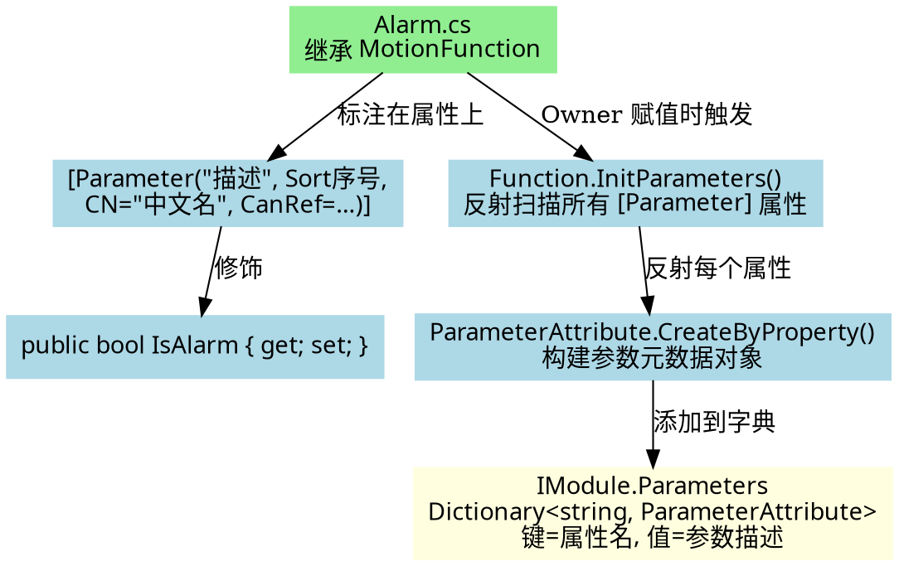
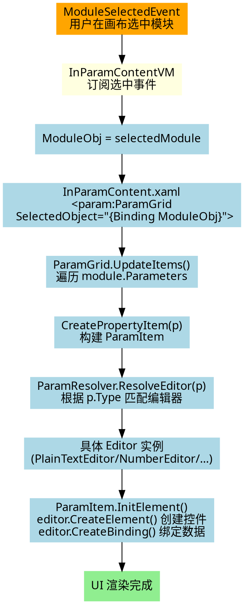
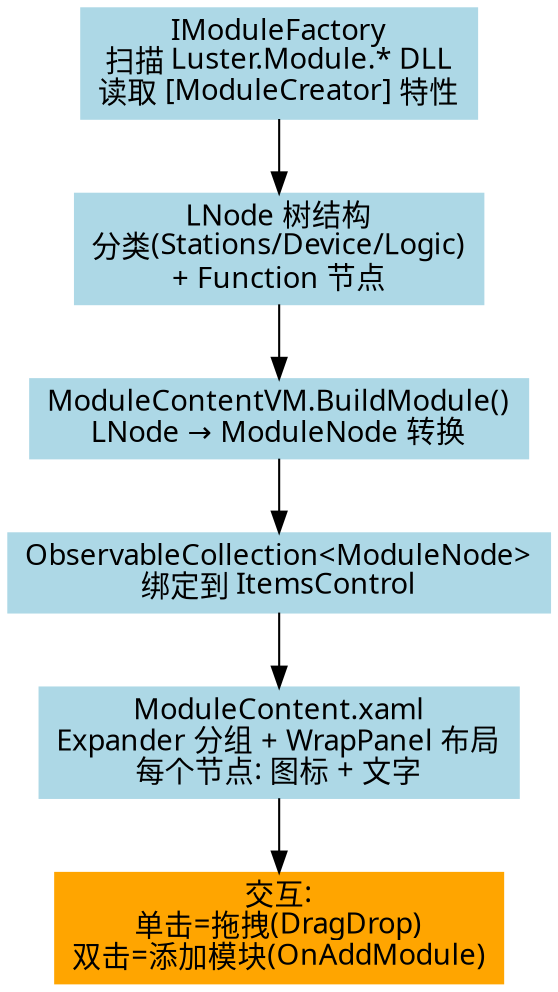
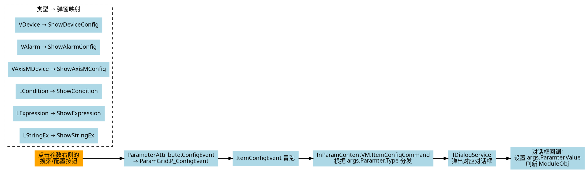
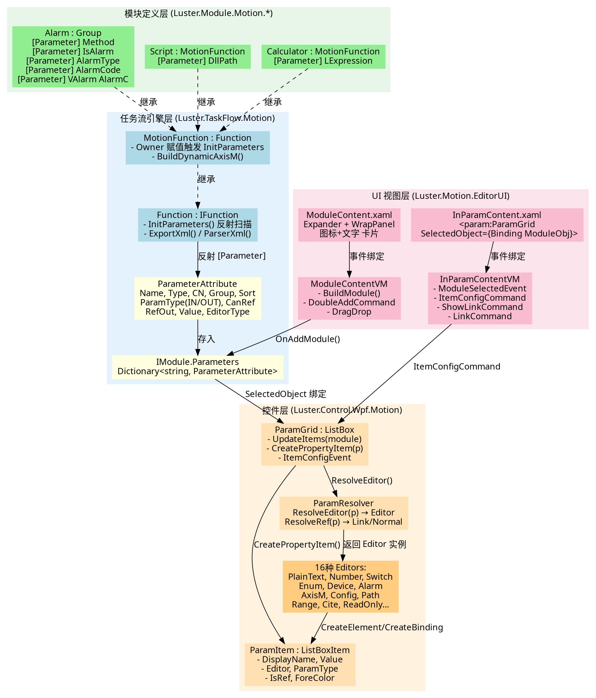

# 运控软件 MotionFunction 渲染逻辑与扩展指南

这份指南详细解析了当前架构下，运控软件是如何根据继承自 `MotionFunction` 的类自动渲染出左侧模块列表（`ModuleContent`）以及对应的参数配置面板（`InParamContent`），并提供完整的架构与数据流分析、扩展教程和 DOT 流程图。

---

## 一、核心分层架构

```
┌──────────────────────────────────────────────────────┐
│                    UI 层 (EditorUI)                   │
│  InParamContent.xaml  │  ModuleContent.xaml           │
│  InParamContentVM.cs  │  ModuleContentVM.cs           │
├───────────────────────┼──────────────────────────────┤
│            控件层 (Luster.Control.Wpf.Motion)         │
│       ParamGrid → ParamItem → ParamResolver           │
│       16种 Editors (PlainText, Number, Enum, Device…) │
├──────────────────────────────────────────────────────┤
│           任务流引擎层 (Luster.TaskFlow.Motion)        │
│  MotionFunction → Function.InitParameters()           │
│  ParameterAttribute (参数元数据定义)                    │
├──────────────────────────────────────────────────────┤
│           模块定义层 (Luster.Module.Motion.*)          │
│  Alarm, Cylinder, Calculator, Script, …               │
│  [Parameter] 特性标注参数属性                           │
└──────────────────────────────────────────────────────┘
```

---

## 二、渲染数据流（从 Function 到 UI）

### 2.1 参数定义与收集



**关键代码路径**:

1. **Function 类**（如 `Alarm.cs`）的属性用 `[Parameter]` 特性标注
2. 当 `Function.Owner` 被赋值时，自动调用 `InitParameters()`
3. `InitParameters()` 反射扫描所有带 `[Parameter]` 的属性
4. `ParameterAttribute.CreateByProperty()` 为每个属性构建参数元数据
5. 元数据存入 `IModule.Parameters` 字典

### 2.2 InParamContent 参数面板渲染



### 2.3 ModuleContent 模块列表渲染



---

## 三、参数类型 → 编辑器完整映射表

ParamResolver 是参数渲染的核心调度器，根据 `ParameterAttribute.Type` 决定使用哪个 Editor：

| 参数 Type | Editor 类 | UI 表现 | 终端功能 |
|-----------|----------|---------|---------|
| `string` | PlainTextEditor | 文本输入框 | Link |
| `int/long/float/double` | NumberEditor | 数值微调器 | Link |
| `bool` | SwitchEditor | 开关切换 | Link |
| `Enum` 子类 | EnumEditor | 下拉枚举选择 | Normal |
| `Enum`(MultiValues) | MEnumEditor | 多选枚举 | Normal |
| `VDevice` | DeviceEditor | 设备选择 + 🔍搜索按钮 | 搜索弹窗 |
| `VAlarm` | AlarmEditor | 报警代码 + 🔍搜索按钮 | 搜索弹窗 |
| `VAxisMDevice`/`VAxisDevice` | AxisMEditor | 轴配置控件 | 搜索弹窗 |
| `VAxisPos` | ConfigEditor | 配置按钮 → 弹窗 | 弹窗选择 |
| `SocketAction` | SlaveEditor | 从站配置控件 | 搜索弹窗 |
| `LCondition` | ConfigEditor | 条件配置按钮 → 弹窗 | 弹窗编辑 |
| `LExpression` | ConfigEditor | 表达式配置按钮 → 弹窗 | 弹窗编辑+变量选择 |
| `LStringEx` | ConfigEditor | 字符串扩展按钮 → 弹窗 | 弹窗编辑+变量选择 |
| `LStringMatch` | ConfigEditor | 字符串匹配按钮 → 弹窗 | 弹窗编辑 |
| `LStation` | ConfigEditor | 工站选择按钮 → 弹窗 | 弹窗选择 |
| `LModule` | ConfigEditor | 模块选择按钮 → 弹窗 | 弹窗选择 |
| `LArray<>` | ConfigEditor | 数组配置按钮 → 弹窗 | 弹窗编辑 |
| `LPath` | PathEditor | 文件路径选择 | 文件对话框 |
| `LRange` | RangeEditor | 范围编辑器 | Link |
| `LNetwork` | NetworkEditor | 网络配置 | Link |
| OUT 参数 | ReadOnlyTextEditor | 只读文本 | Save/Normal |
| 有 RefOut | CiteEditor | 引用显示(绿色文字) | 引用链接 |

---

## 四、终端功能详解（搜索/链接变量）

### 4.1 链接变量 (Link/Ref) — 绿色链接图标 🔗


**引用显示判断** (`ParamResolver.ResolveRef`):
- `CanRef == ParamRef.Ref` → 显示链接图标
- `CanRef == ParamRef.NoRef` → 不显示
- 枚举/值类型/复杂类型 → 不显示
- 其他类型 → 默认显示

### 4.2 搜索/配置按钮 — 🔍搜索图标



---

## 五、完整渲染架构 DOT 图



---

## 六、扩展教程

### 6.1 添加新 Function

以添加 "延时等待" 功能为例：

**步骤 1**: 在模块项目中创建 Function 类

```csharp
// 文件: src/Modules/Luster.Module.Motion.Logic/Functions/DelayWait.cs
using Luster.TaskFlow.Common.Attributes;
using Luster.TaskFlow.Motion;
using Luster.TaskFlow.Motion.Logic;

namespace Luster.Module.Motion.Logic.Functions
{
    public class DelayWait : Group
    {
        [Parameter("延时时间（毫秒）", 0, CN = "延时时间")]
        public int DelayMs { get; set; } = 1000;

        [Parameter("是否启用延时", 1, CN = "是否启用")]
        public bool IsEnabled { get; set; } = true;

        public DelayWait()
        {
            this.Tips = "延时等待指定时间";
            this.Icon = "\xe600";
        }

        public override bool DoExcute(out string errMsg)
        {
            errMsg = "";
            if (IsEnabled && DelayMs > 0)
                System.Threading.Thread.Sleep(DelayMs);
            return true;
        }
    }
}
```

**关键特性参数说明**:

| Parameter 参数 | 含义 | 示例 |
|---------------|------|------|
| 第1参数 | 描述/Tips | `"延时时间（毫秒）"` |
| 第2参数 | Sort排序 | `0`, `1`, `2`… |
| `CN` | 中文显示名 | `CN = "延时时间"` |
| `CanRef` | 是否可被引用链接 | `CanRef = ParamRef.Ref` |
| `DefaultV` | 默认值 | `DefaultV = 1000` |
| `IsReadOnly` | 是否只读 | `IsReadOnly = false` |
| `Visible` | 是否可见 | `Visible = false` |
| `EditorType` | 指定编辑器类型 | `EditorType = typeof(VAlarm)` |

**参数依赖（动态显隐）**:
```csharp
// 当 Method == AlarmMethod.Normal 时才显示
[DependOn("Method", AlarmMethod.Normal)]
[Parameter("是否报警", 1, CN = "是否报警")]
public bool IsAlarm { get; set; }
```

### 6.2 添加新的 InParam 参数类型

> 详细 DOT 图见: [InParamType_Extension.dot](InParamType_Extension.dot)

#### 6.2.1 架构原理

新增一个 InParam 类型需要跨 **4 个项目层** 修改，涉及 **9 个步骤**。核心机制是：

```
数据模型 (定义 Type) → Editor (渲染控件) → ParamResolver (映射 Type→Editor)
  → Dialog (弹窗交互) → InParamContentVM (事件分发) → Function (使用参数)
```

运行时自动链路（无需手动编码）：
1. `Function.Owner` 赋值 → `InitParameters()` → 反射扫描 `[Parameter]` → `CreateByProperty()`
2. `ParamGrid.UpdateItems()` → `ResolveEditor(p.Type)` → 返回匹配的 Editor
3. `ParamItem.InitElement()` → `Editor.CreateElement()` 创建控件 → `Editor.CreateBinding()` 绑定数据
4. 用户点击按钮 → `ConfigEvent` 冒泡 → `ItemConfigCommand` 分发 → 弹窗

#### 6.2.2 完整实现步骤（以 LFileSelect 为例）

**步骤 1**: 定义数据模型（实现 `IXMLParser`，支持序列化）

```csharp
// 新建文件: src/TaskFlow/Luster.TaskFlow.Common/Models/LFileSelect.cs
public class LFileSelect : IXMLParser
{
    public string FilePath { get; set; }
    public string Filter { get; set; } = "All|*.*";

    public XElement ExportXml()
    {
        return new XElement("FileSelect",
            new XAttribute("Path", FilePath ?? ""),
            new XAttribute("Filter", Filter));
    }

    public void ParserXml(XElement xElement)
    {
        FilePath = xElement.Attribute("Path")?.Value ?? "";
        Filter = xElement.Attribute("Filter")?.Value ?? "All|*.*";
    }
}
```

**步骤 2**: 注册类型映射（在模块初始化时调用）

```csharp
// 在 Module 初始化代码中添加:
ParameterAttribute.ResgisterTypeMaps("LFileSelect", typeof(LFileSelect));
```
> 这确保 `ParameterAttribute.ParserXml()` 能通过字符串 "LFileSelect" 还原为 `typeof(LFileSelect)`。

**步骤 3**: 创建自定义 WPF 控件（带搜索按钮）

```csharp
// 新建文件: src/Controls/Luster.Control.Wpf.Motion/Controls/FileSelectCtrl.cs
public class FileSelectCtrl : System.Windows.Controls.Control
{
    // DependencyProperty: Value, Text, IsReadOnly
    public static readonly DependencyProperty ValueProperty =
        DependencyProperty.Register("Value", typeof(object), typeof(FileSelectCtrl),
            new PropertyMetadata(default, PropertyChangedCallback));

    public static readonly DependencyProperty TextProperty =
        DependencyProperty.Register("Text", typeof(string), typeof(FileSelectCtrl),
            new PropertyMetadata(""));

    public bool IsReadOnly { get; set; }

    // 持有参数引用（关键！）
    private ParameterAttribute parameter;
    public ParameterAttribute Parameter
    {
        get => parameter;
        set
        {
            parameter = value;
            // 根据 parameter.Value 更新 Text 显示
            Text = parameter.Value?.ToString() ?? "";
        }
    }

    // 关键设计模式: 内嵌按钮
    protected const string PART_BtnConfig = nameof(PART_BtnConfig);
    private Button btnView;

    public override void OnApplyTemplate()
    {
        base.OnApplyTemplate();
        btnView = GetTemplateChild(PART_BtnConfig) as Button;
        if (btnView != null)
            btnView.Click += (s, e) => Parameter.OnConfig(Parameter);
            // ↑ 触发 ConfigEvent，开始事件冒泡链
    }
}
```

> XAML 模板需在 `Generic.xaml` 中定义，包含 `TextBlock` + `Button x:Name="PART_BtnConfig"`

**步骤 4**: 创建 Editor（连接控件到 ParamGrid）

```csharp
// 新建文件: src/Controls/Luster.Control.Wpf.Motion/ParamGrid/Editors/FileSelectEditor.cs
public class FileSelectEditor : ParamEditorBase
{
    public override FrameworkElement CreateElement(ParamItem propertyItem)
    {
        var ctrl = new FileSelectCtrl();
        ctrl.IsReadOnly = propertyItem.IsReadOnly;
        ctrl.Parameter = propertyItem.Value as ParameterAttribute;
        return ctrl;
    }

    public override DependencyProperty GetDependencyProperty()
        => FileSelectCtrl.ValueProperty;
}
```

> `ParamEditorBase.CreateBinding()` 会自动将 `ParamItem.Value` 绑定到控件的 `Value` DP。

**步骤 5**: 在 ParamResolver 中注册映射

```csharp
// 修改文件: src/Controls/Luster.Control.Wpf.Motion/ParamGrid/ParamResolver.cs
// 在 ResolveEditor() 方法的 else if 链中添加:
else if (p.Type == typeof(LFileSelect))
{
    editor = new FileSelectEditor();
}

// 如不需要链接功能，在 ResolveRef() 中添加:
// typeof(LFileSelect).IsAssignableFrom(p.Type) → return "Normal";
```

**步骤 6**: 创建配置弹窗

```csharp
// 新建: src/ui/Luster.Motion.EditorUI/Views/Dialogs/FileSelectDialog.xaml
// 新建: src/ui/Luster.Motion.EditorUI/ViewModel/Dialogs/FileSelectDialogVM.cs

public class FileSelectDialogVM : MotionDialogVM  // 或实现 IDialogAware
{
    private string _filePath;
    public string FilePath
    {
        get => _filePath;
        set => SetProperty(ref _filePath, value);
    }

    public override void OnDialogOpened(IDialogParameters parameters)
    {
        base.OnDialogOpened(parameters);
        // 接收传入的参数
        if (parameters.TryGetValue<ParameterAttribute>("Parameter", out var pAttr))
        {
            if (pAttr.Value is LFileSelect sel)
                FilePath = sel.FilePath;
        }
    }

    // 选择文件命令
    private DelegateCommand _selectCommand;
    public DelegateCommand SelectCommand => _selectCommand ?? (_selectCommand = new DelegateCommand(() =>
    {
        var dialog = new OpenFileDialog { Filter = "所有文件|*.*" };
        if (dialog.ShowDialog() == true)
            FilePath = dialog.FileName;
    }));

    // 确认命令
    private DelegateCommand _okCommand;
    public DelegateCommand OKCommand => _okCommand ?? (_okCommand = new DelegateCommand(() =>
    {
        var result = new LFileSelect { FilePath = FilePath };
        var r = new DialogResult(ButtonResult.OK);
        r.Parameters.Add("FileSelect", result);
        RaiseRequestClose(r);
    }));
}
```

**步骤 7**: 注册弹窗到 DI 容器

```csharp
// 修改文件: src/ui/Luster.Motion.EditorUI/EditorModule.cs
// 在 RegisterTypes() 方法中添加:
containerRegistry.RegisterDialog<FileSelectDialog, FileSelectDialogVM>();
```

**步骤 8**: 添加 DialogService 扩展方法

```csharp
// 修改文件: src/ui/Luster.Motion.CommonUI/Extensions/DialogExtension.cs
// (或 src/ui/Luster.Common.Assets/Extension/DialogServiceExntesion.cs)

public static void ShowFileSelectDialog(this IDialogService service,
    ParameterAttribute pAttr, Action<IDialogResult> callback = null)
{
    DialogParameters param = new DialogParameters();
    param.Add("Title", pAttr.CN);
    param.Add("Parameter", pAttr);
    service.ShowDialog("FileSelectDialog", param, callback);
}
```

**步骤 9**: 在 InParamContentVM.ItemConfigCommand 中添加处理

```csharp
// 修改文件: src/ui/Luster.Motion.EditorUI/ViewModel/InParamContentVM.cs
// 在 ItemConfigCommand 的 if-else 链中添加:

else if (args.Paramter.Type == typeof(LFileSelect))
{
    _dialogService.ShowFileSelectDialog(args.Paramter, r =>
    {
        if (r.Result == ButtonResult.OK
            && r.Parameters.TryGetValue<LFileSelect>("FileSelect", out var sel))
        {
            args.Paramter.Value = sel;
        }
        // 刷新 UI（关键！触发 ParamGrid 重新绑定）
        var src = ModuleObj;
        ModuleObj = null;
        ModuleObj = src;
    });
}
```

**步骤 10**: 在 Function 中使用新参数类型

```csharp
[Parameter("选择配置文件", 0, CN = "配置文件")]
public LFileSelect ConfigFile { get; set; }
```

### 6.3 为 InParam 终端添加搜索/链接等自定义控件

> 详细 DOT 图见: [InParamTerminal_Extension.dot](InParamTerminal_Extension.dot)

#### 6.3.1 搜索按钮 (🔍) 事件冒泡链

搜索按钮是 InParam 终端最常见的高级功能。完整的事件链路经过 **10 个节点**：

```
① 用户点击 🔍 按钮
② XxxCtrl.BtnView_Click()          ← 控件层 (Controls/)
   → Parameter.OnConfig(Parameter)
③ ParameterAttribute.ConfigEvent     ← 数据层 (Attributes/)
   触发 (event Action<ParameterAttribute>)
④ ParamGrid.P_ConfigEvent()         ← 控件层 (ParamGrid/)
   → OnItemConfig() 冒泡
⑤ ParamGrid.ItemConfigEvent          ← 路由事件
   (RoutedEvent, Bubble 策略)
⑥ InParamContent.xaml 中             ← UI层 XAML
   hc:EventTrigger 捕获
   → hc:EventToCommand Command="{Binding ItemConfigCommand}"
⑦ InParamContentVM.ItemConfigCommand ← ViewModel层
   根据 args.Paramter.Type 分发:
   typeof(VAlarm) → ShowAlarmConfig()
⑧ DialogExtension.ShowAlarmConfig()  ← 服务扩展层
   → service.ShowDialog("AlarmCodeDialog",...)
⑨ AlarmCodeDialog 弹窗显示          ← Dialog层
   用户搜索/选择
⑩ callback 回调:                     ← 回到 ViewModel层
   args.Paramter.Value = vAlarm
   ModuleObj = null; ModuleObj = src  ← 触发 ParamGrid 刷新
```

#### 6.3.2 链接变量 (🔗) 事件链路

链接变量的链路不同于搜索按钮，它使用 `PreviewMouseDown` 事件 + `ContextMenu` 右键菜单：

```
① 点击参数名旁的链接图标区域
   (TextBlock Tag=ParameterAttribute)
② ParamGrid.PreviewMouseLeftButtonDown
   → InParamContent.xaml: hc:EventToCommand → ShowLinkCommand
③ InParamContentVM.ExcuteShowLinkCommand():
   检查权限: pGrid.HasPermission
   判断类型: p.ParamType == ParamType.IN
   获取引用源: eventBus.GetRefNodes(p) → LNode 列表
   构建 ContextMenu:
     RefNodes (可引用的输出参数)
     + Separator
     + Clear 选项 (红色)
④ ContextMenu 右键菜单显示给用户
⑤ LinkCommand 执行:
   Clear → dst.RefOut = null
   选择 → dst.RefOut = src
⑥ RefOut setter 触发:
   Owner.UnRegisterByRef()     取消旧引用
   RefChangedEvent?.Invoke()   通知 UI 刷新
   Owner.UpdateReferences()    更新引用关系表
⑦ ParamGrid.P_RefChangedEvent():
   遍历所有 ParamItem:
     IsRef = (changeItem.RefOut != null)
     ForeColor = IsRef ? "Green" : "Red"
     Editor = ResolveEditor()   切换编辑器
     InitElement()              刷新 UI
```

#### 6.3.3 链接图标显示判断

`ParamResolver.ResolveRef()` 决定参数是否显示链接图标：

```csharp
// ParamResolver.cs
public virtual string ResolveRef(ParameterAttribute p)
{
    // 1. OUT 参数 → "Save" 或 "Normal"
    if (p.ParamType == ParamType.OUT) { ... }

    // 2. 显式声明可引用
    if (p.CanRef == ParamRef.Ref) return "Link";

    // 3. 显式声明不可引用
    if (p.CanRef == ParamRef.NoRef) return "Normal";

    // 4. 已知不需要引用的类型
    if (p.Type.IsEnum || p.Type.IsValueType || typeof(string) == p.Type
        || typeof(VDevice) == p.Type || typeof(LCondition) == p.Type
        || typeof(LExpression) == p.Type
        /* ... 其他已知类型 */) return "Normal";

    // 5. 默认 → 显示链接
    return "Link";
}
```

控制新类型是否可链接：
- 不需要链接：将新类型添加到步骤 4 的判断链中
- 需要链接：默认行为即可，或在 `[Parameter]` 中设置 `CanRef = ParamRef.Ref`

#### 6.3.4 参考实例：现有带搜索按钮的控件

| 控件 | 文件 | Editor | 弹窗名 | 搜索关键词 |
|------|------|--------|--------|-----------|
| DeviceCtrl | `Controls/DeviceCtrl.cs` | DeviceEditor | DeviceDialog | 设备名 |
| AlarmCtrl | `Controls/AlarmCtrl.cs` | AlarmEditor | AlarmCodeDialog | 报警代码 |
| SlaveCtrl | `Controls/SlaveCtrl.cs` | SlaveEditor | SlaveDialog | 从站地址 |
| ConfigCtrl | `Controls/ConfigCtrl.cs` | ConfigEditor | 各类弹窗 | 通用按钮 |

> 所有带搜索按钮的控件都遵循相同模式：`Control + PART_BtnConfig Button → Parameter.OnConfig()`。

### 6.4 添加新的 Module 分类

模块分类由 `IModuleFactory.GetModuleNode()` 返回的 `LNode` 树决定，通过程序集级 `[ModuleCreator]` 特性自动注册。

---

## 七、关键文件索引

| 职责 | 文件路径 |
|------|---------|
| Function 基类 | `src/TaskFlow/Luster.TaskFlow.Common/Functions/Function.cs` |
| IFunction 接口 | `src/TaskFlow/Luster.TaskFlow.Common/Functions/IFunction.cs` |
| MotionFunction | `src/TaskFlow/Luster.TaskFlow.Motion/Functions/MotionFunction.cs` |
| ParameterAttribute | `src/TaskFlow/Luster.TaskFlow.Common/Attributes/ParameterAttribute.cs` |
| ParamGrid 控件 | `src/Controls/Luster.Control.Wpf.Motion/ParamGrid/ParamGrid.cs` |
| ParamResolver | `src/Controls/Luster.Control.Wpf.Motion/ParamGrid/ParamResolver.cs` |
| ParamItem | `src/Controls/Luster.Control.Wpf.Motion/ParamGrid/ParamItem.cs` |
| 16种 Editors | `src/Controls/Luster.Control.Wpf.Motion/ParamGrid/Editors/` |
| InParamContent View | `src/ui/Luster.Motion.EditorUI/Views/InParamContent.xaml` |
| InParamContentVM | `src/ui/Luster.Motion.EditorUI/ViewModel/InParamContentVM.cs` |
| ModuleContent View | `src/ui/Luster.Motion.EditorUI/Views/ModuleContent.xaml` |
| ModuleContentVM | `src/ui/Luster.Motion.EditorUI/ViewModel/ModuleContentVM.cs` |
| ModuleNode | `src/ui/Luster.Motion.EditorUI/Models/ModuleNode.cs` |
| Alarm 示例 | `src/Modules/Luster.Module.Motion.Logic/Functions/Alarm.cs` |
| IModuleFactory | `src/TaskFlow/Luster.TaskFlow.Common/Factory/IModuleFactory.cs` |
| Editor 注册 | `src/ui/Luster.Motion.EditorUI/EditorModule.cs` |
| DialogService 扩展 | `src/ui/Luster.Motion.CommonUI/Extensions/DialogExtension.cs` |
| DialogService 扩展(公共) | `src/ui/Luster.Common.Assets/Extension/DialogServiceExntesion.cs` |
| 自定义控件目录 | `src/Controls/Luster.Control.Wpf.Motion/Controls/` |
| 弹窗 Views 目录 | `src/ui/Luster.Motion.EditorUI/Views/Dialogs/` |
| 弹窗 VM 目录 | `src/ui/Luster.Motion.EditorUI/ViewModel/Dialogs/` |

## 八、DOT 图索引

| 文件 | 内容 |
|------|------|
| [RenderDataFlow.dot](RenderDataFlow.dot) | 完整渲染架构图（4层 + 数据流） |
| [InParamType_Extension.dot](InParamType_Extension.dot) | 6.2 新增 InParam 类型：9步实现路径 + 运行时自动链路 |
| [InParamTerminal_Extension.dot](InParamTerminal_Extension.dot) | 6.3 搜索按钮(10步事件链) + 链接变量(7步事件链) + 完整步骤清单 |
