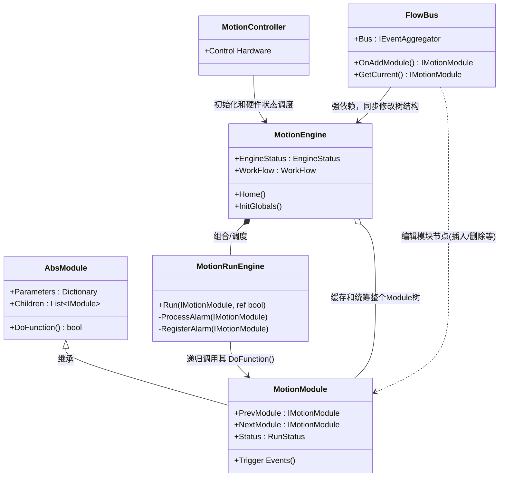

# 模块关系与调用图

```mermaid
classDiagram
    %% 继承关系
    class AbsModule {
        +DoFunction() bool
        +Parameters : Dictionary
        +Children : List~IModule~
    }
    class MotionModule {
        +PrevModule : IMotionModule
        +NextModule : IMotionModule
        +Status : RunStatus
        +Trigger Events()
    }
    AbsModule <|-- MotionModule : 继承

    %% 运行引擎管理单条链
    class MotionRunEngine {
        +Run(IMotionModule, ref bool)
        -ProcessAlarm(IMotionModule)
        -RegisterAlarm(IMotionModule)
    }
    MotionRunEngine --> MotionModule : 递归调用其 DoFunction()

    %% 总控引擎
    class MotionEngine {
        +EngineStatus : EngineStatus
        +WorkFlow : WorkFlow
        +Home()
        +InitGlobals()
    }
    MotionEngine *-- MotionRunEngine : 组合/调度
    MotionEngine o-- MotionModule : 缓存和统筹整个Module树

    %% 流程业务层
    class MotionController {
        +Control Hardware
    }
    MotionController --> MotionEngine : 初始化和硬件状态调度

    %% UI 编辑器总线
    class FlowBus {
        +Bus : IEventAggregator
        +OnAddModule() IMotionModule
        +GetCurrent() IMotionModule
    }
    FlowBus --> MotionEngine : 强依赖，同步修改树结构
    FlowBus ..> MotionModule : 编辑模块节点(插入/删除等)
```