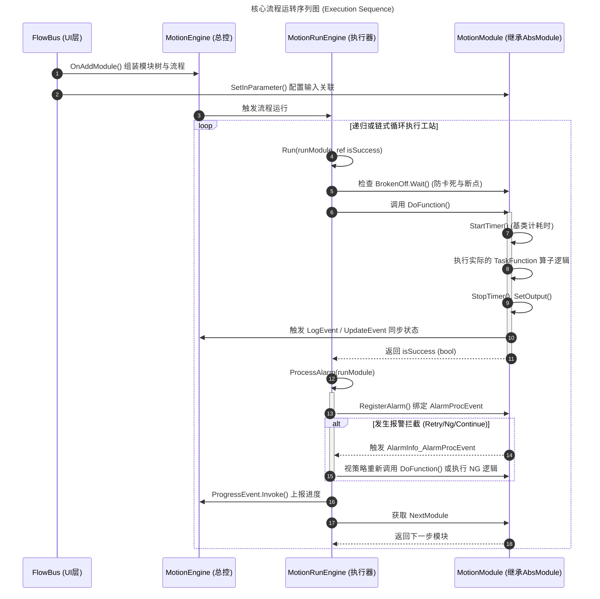

# 核心流程运转序列图 (Execution Sequence)

```mermaid
sequenceDiagram
    autonumber
    title 核心流程运转序列图 (Execution Sequence)

    participant Editor as FlowBus (UI层)
    participant Engine as MotionEngine (总控)
    participant RunEngine as MotionRunEngine (执行器)
    participant Module as MotionModule (继承AbsModule)

    %% 编辑与初始化阶段
    Editor->>Engine: OnAddModule() 组装模块树与流程
    Editor->>Module: SetInParameter() 配置输入关联

    %% 运行阶段
    Engine->>RunEngine: 触发流程运行
    loop 递归或链式循环执行工站
        RunEngine->>RunEngine: Run(runModule, ref isSuccess)
        
        %% 暂停/断点检查
        RunEngine->>Module: 检查 BrokenOff.Wait() (防卡死与断点)
        
        %% 核心执行
        RunEngine->>Module: 调用 DoFunction()
        activate Module
        Module->>Module: StartTimer() (基类计耗时)
        Module->>Module: 执行实际的 TaskFunction 算子逻辑
        Module->>Module: StopTimer(), SetOutput()
        Module->>Engine: 触发 LogEvent / UpdateEvent 同步状态
        Module-->>RunEngine: 返回 isSuccess (bool)
        deactivate Module

        %% 异常与报警干预
        RunEngine->>RunEngine: ProcessAlarm(runModule)
        activate RunEngine
        RunEngine->>Module: RegisterAlarm() 绑定 AlarmProcEvent
        alt 发生报警拦截 (Retry/Ng/Continue)
            Module-->>RunEngine: 触发 AlarmInfo_AlarmProcEvent
            RunEngine->>Module: 视策略重新调用 DoFunction() 或执行 NG 逻辑
        end
        deactivate RunEngine

        %% 进度与流转
        RunEngine->>Engine: ProgressEvent.Invoke() 上报进度
        RunEngine->>Module: 获取 NextModule 
        Module-->>RunEngine: 返回下一步模块
    end
```