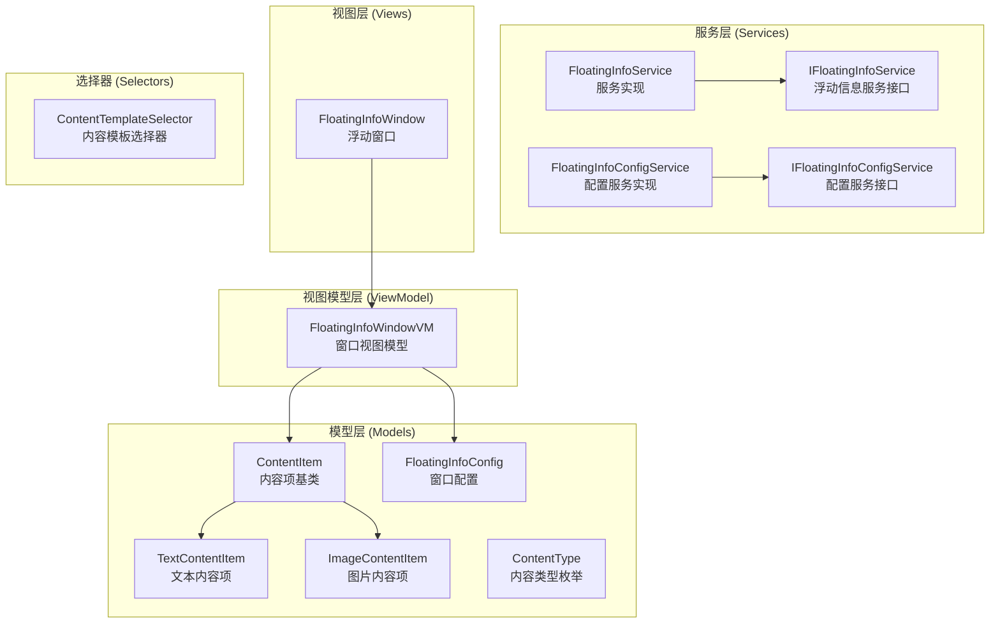

# FloatingInfo 浮动信息窗口使用说明

## 概述

FloatingInfo 是一个用于显示浮动信息窗口的 WPF 组件，支持在屏幕上显示可自定义的文本和图片内容。该组件基于 Prism 框架构建，采用 MVVM 模式设计。

## 架构组成



## 核心接口

### [`IFloatingInfoService`](ui/Luster.Common.Assets/FloatingInfo/Services/IFloatingInfoService.cs:27) - 浮动信息服务接口

| 方法 | 说明 |
|------|------|
| `ShowFloatingInfo(string pageId)` | 显示指定页面的浮动信息窗口 |
| `HideFloatingInfo(string pageId)` | 隐藏指定页面的浮动信息窗口 |
| `HideAllFloatingInfo()` | 隐藏所有浮动信息窗口 |
| `IsVisible(string pageId)` | 检查指定窗口是否可见 |
| `MinimizeFloatingInfo(string pageId)` | 最小化指定窗口 |
| `RestoreFloatingInfo(string pageId)` | 恢复最小化的窗口 |
| `RegisterConfig(FloatingInfoConfig config)` | 注册页面配置 |
| `OpenSettings(string pageId)` | 打开设置对话框 |
| `GetActiveWindowPageIds()` | 获取所有活动窗口的页面ID |

### [`IFloatingInfoConfigService`](ui/Luster.Common.Assets/FloatingInfo/Services/IFloatingInfoConfigService.cs:28) - 配置服务接口

| 方法 | 说明 |
|------|------|
| `GetAllConfigs()` | 获取所有配置 |
| `GetConfig(string pageId)` | 根据页面ID获取配置 |
| `SaveConfig(FloatingInfoConfig config)` | 保存配置 |
| `SaveAllConfigs(IEnumerable configs)` | 保存所有配置 |
| `DeleteConfig(string pageId)` | 删除配置 |
| `ExistsConfig(string pageId)` | 检查配置是否存在 |
| `Load()` | 加载配置文件 |
| `Save()` | 保存配置到文件 |

## 配置类

### [`FloatingInfoConfig`](ui/Luster.Common.Assets/FloatingInfo/Models/FloatingInfoConfig.cs:29) - 窗口配置

| 属性 | 类型 | 默认值 | 说明 |
|------|------|--------|------|
| `PageId` | string | - | 页面唯一标识 |
| `PageName` | string | - | 页面名称（显示标题） |
| `IsEnabled` | bool | true | 是否启用浮动信息 |
| `WindowWidth` | double | 400 | 窗口宽度 |
| `WindowHeight` | double | 300 | 窗口高度 |
| `WindowLeft` | double | NaN | 窗口X位置（屏幕坐标） |
| `WindowTop` | double | NaN | 窗口Y位置（屏幕坐标） |
| `ContentItems` | ObservableCollection | - | 内容项集合 |

## 内容项类型

### [`TextContentItem`](ui/Luster.Common.Assets/FloatingInfo/Models/TextContentItem.cs:28) - 文本内容项

| 属性 | 类型 | 默认值 | 说明 |
|------|------|--------|------|
| `Text` | string | - | 文本内容 |
| `FontSize` | double | 14 | 字体大小 |
| `FontWeight` | FontWeight | Normal | 字体粗细 |
| `TextAlignment` | TextAlignment | Left | 文本对齐方式 |
| `Foreground` | Brush | Black | 前景色 |
| `TextWrapping` | bool | true | 是否支持换行 |
| `Margin` | Thickness | 5 | 边距 |

### [`ImageContentItem`](ui/Luster.Common.Assets/FloatingInfo/Models/ImageContentItem.cs:28) - 图片内容项

| 属性 | 类型 | 默认值 | 说明 |
|------|------|--------|------|
| `ImagePath` | string | - | 图片路径（本地/网络） |
| `ImageSource` | ImageSource | - | 图片源 |
| `MaxWidth` | double | 400 | 最大宽度 |
| `MaxHeight` | double | 300 | 最大高度 |
| `Stretch` | Stretch | Uniform | 拉伸模式 |
| `Margin` | Thickness | 5 | 边距 |

## 使用示例

### 1. 注册服务（在模块初始化时）

```csharp
containerRegistry.RegisterSingleton<IFloatingInfoConfigService, FloatingInfoConfigService>();
containerRegistry.RegisterSingleton<IFloatingInfoService, FloatingInfoService>();
```

### 2. 创建并注册配置

```csharp
// 获取服务
var floatingInfoService = containerProvider.Resolve<IFloatingInfoService>();

// 创建配置
var config = new FloatingInfoConfig
{
    PageId = "MyPage_001",
    PageName = "我的浮动信息",
    IsEnabled = true,
    WindowWidth = 450,
    WindowHeight = 350,
    WindowLeft = 100,
    WindowTop = 100
};

// 添加文本内容
config.ContentItems.Add(new TextContentItem
{
    Text = "这是标题文本",
    FontSize = 18,
    FontWeight = FontWeights.Bold,
    Foreground = Brushes.DarkBlue,
    Order = 1
});

// 添加图片内容
config.ContentItems.Add(new ImageContentItem
{
    ImagePath = @"C:\Images\diagram.png",
    MaxWidth = 400,
    MaxHeight = 250,
    Order = 2
});

// 注册配置
floatingInfoService.RegisterConfig(config);
```

### 3. 显示/隐藏浮动窗口

```csharp
// 显示浮动窗口
floatingInfoService.ShowFloatingInfo("MyPage_001");

// 隐藏浮动窗口
floatingInfoService.HideFloatingInfo("MyPage_001");

// 隐藏所有浮动窗口
floatingInfoService.HideAllFloatingInfo();

// 检查是否可见
bool isVisible = floatingInfoService.IsVisible("MyPage_001");

// 最小化窗口
floatingInfoService.MinimizeFloatingInfo("MyPage_001");

// 恢复窗口
floatingInfoService.RestoreFloatingInfo("MyPage_001");
```

### 4. 动态更新内容

```csharp
// 获取配置服务
var configService = containerProvider.Resolve<IFloatingInfoConfigService>();
var config = configService.GetConfig("MyPage_001");

// 更新文本内容
var textItem = config.ContentItems.OfType<TextContentItem>().FirstOrDefault();
if (textItem != null)
{
    textItem.Text = "更新后的文本内容";
}

// 保存配置
configService.SaveConfig(config);
```

## 文件结构

```
FloatingInfo/
├── Models/
│   ├── ContentItem.cs          # 内容项基类
│   ├── ContentType.cs          # 内容类型枚举
│   ├── FloatingInfoConfig.cs   # 窗口配置类
│   ├── ImageContentItem.cs     # 图片内容项
│   └── TextContentItem.cs      # 文本内容项
├── Selectors/
│   └── ContentTemplateSelector.cs  # 数据模板选择器
├── Services/
│   ├── FloatingInfoConfigService.cs    # 配置服务实现
│   ├── FloatingInfoService.cs          # 浮动信息服务实现
│   ├── IFloatingInfoConfigService.cs   # 配置服务接口
│   └── IFloatingInfoService.cs         # 浮动信息服务接口
├── ViewModel/
│   └── FloatingInfoWindowVM.cs  # 窗口视图模型
└── Views/
    ├── FloatingInfoWindow.xaml      # 窗口XAML
    └── FloatingInfoWindow.xaml.cs   # 窗口代码隐藏
```

## 注意事项

1. **依赖注入**：使用前需确保 `IFloatingInfoService` 和 `IFloatingInfoConfigService` 已在容器中注册
2. **PageId 唯一性**：每个页面的 `PageId` 必须唯一，用于标识不同的浮动窗口
3. **配置持久化**：配置会自动保存，下次启动时会加载之前的配置
4. **线程安全**：服务实现内部使用了字典管理活动窗口，支持多线程访问

## IO点检图片批量导入功能

### 功能概述

IO点检模块支持一键批量导入IO点检图片功能，可以自动匹配图片文件名与IO名称，快速完成多个IO的图片配置。

### 使用方法

1. **准备图片文件**
   - 将IO点检图片放入指定目录（默认：`DigitalConfig/Images/`）
   - 图片文件名应与IO名称保持一致（不含扩展名）
   - 支持的图片格式：`.png`、`.jpg`、`.jpeg`、`.bmp`、`.gif`

2. **执行批量导入**
   - 在IO点检页面点击"批量导入图片"按钮
   - 选择存放图片的文件夹
   - 系统自动匹配图片文件名与IO名称
   - 确认匹配结果后，系统自动更新配置

3. **匹配规则**
   - 精确匹配：图片文件名（不含扩展名）与IO名称完全一致
   - 不区分大小写：`IO1.png` 和 `io1.PNG` 都能匹配到名为 `IO1` 或 `io1` 的IO
   - 未匹配的图片和IO会在结果中列出

4. **配置存储**
   - 图片路径以相对路径形式存储在配置文件中
   - 配置文件：`DigitalConfig/FloatingInfoConfigs.json`
   - 导入前自动备份原配置文件为 `FloatingInfoConfigs.json.backup`

### 示例

假设有以下IO设备：
- `X轴原点`
- `Y轴原点`
- `Z轴限位`

对应的图片文件命名：
- `X轴原点.png`
- `Y轴原点.jpg`
- `Z轴限位.bmp`

导入后，这些IO的浮动信息配置中会自动添加对应的图片路径。
